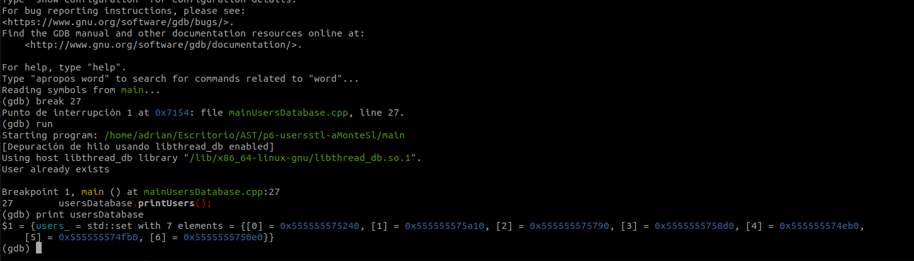

# P6-usersstl-AST_23-24
## Autor: Adrián Montes Linares

## Introducción

El programa principal se encuentra en main.cpp donde podremos lanzar el sistema del invernadero y realizar todas las operaciones posibles. Como compilar el main.cpp y ejecutar el programa se enseñara más adelante.
De momento muestro todas las clases, una explicación breve de ellas y que SOURCES tiene que tener el MakeFile para probar cada clase

1. User.cpp = Define los métodos y atributos básicos de un usuario.
```make
SOURCES = User.cpp mainUser.cpp
```
2. UserAdmin.cpp = Clase de Usuario administrador
```make
SOURCES = User.cpp UserAdmin.cpp mainUserAdmin.cpp
```
3. UserEmployee.cpp = Clase de Usuario employee
```make
SOURCES = User.cpp UserEmployee.cpp mainUserEmployee.cpp
```
4. UserGuest.cpp = Clase de Usuario guest
```make
SOURCES = User.cpp UserGuest.cpp mainUserGuest.cpp
```
5. UserDatabase.cpp = Define los métodos y atributos básicos de una base de datos que almacena usuarios. (Maneja a cada usuario de manera individual de una base de datos)
```make
SOURCES = User.cpp UsersDatabase.cpp mainUsersDatabase.cpp UserAdmin.cpp UserEmployee.cpp UserGuest.cpp
```
6. UsersServer.cpp = Define los métodos y atributos básicos de un servidor que maneja una base de datos. (Maneja al conjunto de usuarios de una base de datos)
```make
SOURCES = User.cpp UsersDatabase.cpp mainUsersServer.cpp UsersServer.cpp
```
* Para compilar UsersServer de momento no es necesario incluir en el SOURCE las clases hijas de User, puede que en un futuro si
7. Sensor.cpp = Define los métodos y atributos básicos de un sensor
```make
SOURCES = Sensor.cpp mainSensor.cpp
```
8. TemperatureSensor.cpp = Define los métodos y atributos de un sensor de temperatura
```make
SOURCES = Sensor.cpp TemperatureSensor.cpp mainTemperatureSensor.cpp
```
9. AirQualitySensor.cpp = Define los métodos y atributos de un sensor de aire
```make
SOURCES = Sensor.cpp AirQualitySensor.cpp mainAirQualitySensor.cpp
```
10. HydrometerSensor.cpp = Define los métodos y atributos de un hydrometro
```make
SOURCES = Sensor.cpp HydrometerSensor.cpp mainHydrometerSensor.cpp
```
11. PressureSensor.cpp = Define los métodos y atributos de un sensor de presión
```make
SOURCES = Sensor.cpp PressureSensor.cpp mainPressureSensor.cpp
```
12. LightSensor.cpp = Define los métodos y atributos de un sensor de luz
```make
SOURCES = Sensor.cpp LightSensor.cpp mainLightSensor.cpp
```
13. PhSensor.cpp = Define los métodos y atributos de un sensor de pH
```make
SOURCES = Sensor.cpp PhSensor.cpp mainPhSensor.cpp
```
14. Hardware.cpp = Define los métodos y atributos de un hardware generico (pantalla/teclado/interruptor)
```make
SOURCES = Hardware.cpp mainHardware.cpp 
```
15. ScreenHardware.cpp = Define los métodos y atributos necesarios de una pantalla
```make
SOURCES = Hardware.cpp mainScreenHardware.cpp ScreenHardware.cpp
```
16. KeyboardHardware.cpp = Define los métodos y atributos necesarios de un teclado
```make
SOURCES = Hardware.cpp mainKeyboardHardware.cpp KeyboardHardware.cpp
```
17. SwitchHardware.cpp = Define los métodos y atributos necesarios de un interruptor
```make
SOURCES = Hardware.cpp mainSwitchHardware.cpp SwitchHardware.cpp
```
18. AlarmSensors.cpp = Define los métodos y atributos necesarios para manejar todos los sensores y sus alarmas
```make
SOURCES = Sensor.cpp TemperatureSensor.cpp AirQualitySensor.cpp HydrometerSensor.cpp PressureSensor.cpp LightSensor.cpp PhSensor.cpp mainAlarmSensor.cpp AlarmSensor.cpp
```
19. MonitoringSystem.cpp = Define los métodos y atributos necesarios para manejar el sistema implementando un hardware de cada tipo
```make
SOURCES = Hardware.cpp MonitoringSystem.cpp mainMonitoringSystem.cpp KeyboardHardware.cpp ScreenHardware.cpp SwitchHardware.cpp
```
20. GreenHouse.cpp = Define los métodos y atributos necesarios para lanzar el sistema del invernadero, controlarlo, ver los sensores, usuarios y el resto de funciones según el rol que tengamos. Por defecto siempre hay tres usuarios, uno de cada tipo
* Nombre NIF Contraseña Privilegios Correo:
- admin 12345678X admin ADMIN admin@example.com
- employee 12345678Y employee EMPLOYEE employee@example.com
- guest 12345678Z guest GUEST guest@example.com

```make
SOURCES =  GreenHouse.cpp AlarmSensors.cpp UsersServer.cpp MonitoringSystem.cpp AirQualitySensor.cpp Hardware.cpp HydrometerSensor.cpp KeyboardHardware.cpp LightSensor.cpp TemperatureSensor.cpp User.cpp mainGreenHouse.cpp PhSensor.cpp PressureSensor.cpp ScreenHardware.cpp Sensor.cpp SwitchHardware.cpp UsersDatabase.cpp
```
                                                                   
## Objetivos de la práctica
- El objetivo de la practica es almacenar en un set los punteros correspondientes a los usuarios, de esta forma mejoramos el uso de memoria. Para ello aprovecharemos la libreria STL
1. User.h: Define todos los metodos y atributos que tiene un usuario
```cpp
#ifndef USER_H
#define USER_H

#include <string>

class User {
 public:

  User();

  explicit User(const std::string name, const std::string nif,
                std::string password, std::string privileges, std::string email);

  std::string getName() const;
  std::string getNif() const;
  std::string getPassword() const;
  std::string getPrivileges() const;
  std::string getEmail() const;

  void setName(const std::string name);
  void setNif(const std::string nif);
  void setPassword(const std::string password);
  virtual void setPrivileges(const std::string privileges);
  void setEmail(const std::string email);

  // Reciben como parametro el puntero a un objeto de la clase User y devuelven un booleano
  bool operator<(const User& user) const;
  bool operator>(const User& user) const;
  bool operator==(const User& user) const;
  friend std::ostream& operator<<(std::ostream& os, const User& user);
  friend std::istream& operator>>(std::istream& is, User& user);
  void printUser() const;

  // Destructor
  virtual ~User();

 private:
  std::string name;
  std::string nif;
  std::string password;
  std::string privileges;
  std::string email;
};

#endif
```
2. UserAdmin.h / UserEmployee.h / UserGuest.h: Son tres clases que heredan de usuario, las cuales son los distintos tipo de usuarios que podremos tener, Admin/Employee/Guest. Como ejemplo se muestra UserAdmin.h, los otros dos headers son identicos cambiando Admin por el privilegio correspondiente.
```cpp
#ifndef USERADMIN_H
#define USERADMIN_H

#include "User.h"
#include <string>

// Clase Admin clase hija de Usuario
class UserAdmin : public User {
public:
    // Constructor por defecto
    UserAdmin();
    // Constructor con parametros
    explicit UserAdmin(const std::string name, const std::string nif, std::string password,
                    std::string email);
    // Destructor
    virtual ~UserAdmin();

};

#endif // USERADMIN_H
```
3. UserDatabase.h: Clase que almacena y manipula a los usuarios de nuestro invernadero, para ello tiene sus propios metodos y como atributo el set de punteros a los distintos usuarios, este atributo es privado y se llama users_
```cpp
#ifndef USERSDATABASE_H
#define USERSDATABASE_H

#include <set>
#include "User.h"

//  SOURCES = User.cpp UsersDatabase.cpp mainUsersDatabase.cpp UserAdmin.cpp UserEmployee.cpp UserGuest.cpp

// Declaracion anticipada de la cada clase de User
class UserAdmin;
class UserEmployee;
class UserGuest;


class UserPtrComparator {
  public:
      bool operator()(const User* us1, const User* us2) const {
          // Comparar dnis de usuarios si tienen el mismo dni no se puede añadir el usuario
          return us1->getNif() < us2->getNif();
      }
};

class UserNameComparator {
public:
    bool operator()(const User* lhs, const User* rhs) const {
        return lhs->getName() < rhs->getName();
    }
};

// UserDatabase:es para controlar todos los usuarios
class UsersDatabase {
 public:
  // Constructor por defecto
  // Tengo que hacer un set de usuarios para luego añadirlos con .insert en el metodo setUsers
  UsersDatabase();

  // Destructor
  ~UsersDatabase();


  // Funcion para añadir un usuario al set de usuarios, el set de usuarios es el conjunto de direcciones de memoria, almacena los punteros
  void addUser(const User* user);
  // getUsers devuelve un set de usuarios, getUsers devuelve un set de punteros a usuarios
  std::set<const User*, UserPtrComparator> getUsers() const;
  // setUsers recibe un set de usuarios, setUsers recibe un set de punteros a usuarios
  void setUsers(const std::set<const User*, UserPtrComparator>& users);

  // Ahora se implementan funciones para buscar un usuario por usuario, por
  // nombre, por NIF, por correo electrónico
  User* findUser(const User& user) const;
  User* findUserByName(const std::string name) const;
  User* findUserByNif(const std::string nif) const;
  User* findUserByPassword(const std::string password) const;
  User* findUserByEmail(const std::string email) const; 
  
  
  // Ahora se implementa la funcion para eliminar un usuario por usuario, por
  // nombre, por NIF, por correo electrónico
  
  void deleteUser(const User& user);
  void deleteUserByName(const std::string name);
  void deleteUserByNif(const std::string nif);
  void deleteUserByEmail(const std::string email);

  bool isValidPrivileges(const std::string privileges) const;

  // Ahora imprimimos todos los usuarios
  void printUsers() const;

 private:
  // Aqui se definen los atributos privados de la clase UsersDatabase
  // Hacer el conjunto de ususarios con set
  std::set<const User*, UserPtrComparator> users_;
  
  
  void printDeletedUser(const User* user) const;
};

#endif  // UsersDatabase
```
- Usando gdb podemos ver como es set con un array de punteros a usuarios (en la imagen 7 elementos en el set)


4. UserServer.h: Clase que se encarga de almacenar y de leer datos de un fichero llamado users.data, y de manejar a un objeto base de datos de usuarios
```cpp
#ifndef USERSSERVER_H
#define USERSSERVER_H
#include <string>

#include "UsersDatabase.h"

// UsersServer:es para controlar todos los usuarios
// Los usuarios estan almacenados en un objeto de la clase UsersDatabase

class UsersServer {
 public:
  // Constructor (necesario pasarle la base de datos)
  UsersServer();
  // Destructor
  ~UsersServer();

  void createUser(const std::string name, const std::string nif,
                  const std::string password, const std::string privileges,
                  const std::string email);
  void deleteUser(const std::string nif);
  void printUsersServer() const;
  void loadUsersFromFile();
  void saveUsersToFile();
  bool findUserLogin(std::string name, std::string password, std::string nif);
  std::string getPrivileges(std::string nif);
  void updateUser(const std::string name, const std::string nif,
                  const std::string password, const std::string privileges,
                  const std::string email);

 private:
  // Aqui se definen los atributos privados de la clase UsersServer
  UsersDatabase usersDatabase_;
  // File
  std::string fileName_ = "users.dat";
};

#endif  // USERSSERVER_H
```


## Compilar y ejecutar
### Compilar
- Con el siguiente comando se compila todos los .cpp que se encuntren en SOURCES
```bash
make
```
- Con el siguiente comando se limpia todos los .o de los .cpp que se encuetren en SOURCES
```bash
make clean
```
- Con el siguiente comando se le aplican unas normas de estilo a los .cpp y a los .h
```bash
make format
```
### Ejecutar
Por defecto el SOURCES tiene todo lo necesrio para compilar el programa principal **main.cpp**. Aquí están los pasos
1. Comprobar que el SOURCES es el necesario para compilar main.cpp, por defecto esta puesto el SOURCES correcto:
```make
SOURCES =  main.cpp GreenHouse.cpp AlarmSensors.cpp UsersServer.cpp MonitoringSystem.cpp AirQualitySensor.cpp Hardware.cpp HydrometerSensor.cpp KeyboardHardware.cpp LightSensor.cpp TemperatureSensor.cpp UserAdmin.cpp UserGuest.cpp UserEmployee.cpp User.cpp PhSensor.cpp PressureSensor.cpp ScreenHardware.cpp Sensor.cpp SwitchHardware.cpp UsersDatabase.cpp
```
2. Compilar con el comando del apartado anterior:
```bash
make
```
3. Ejecutar el programa, cualquier programa se ejecutara como a continación independientemente del SOURCES del MakeFile
```bash
./main
```